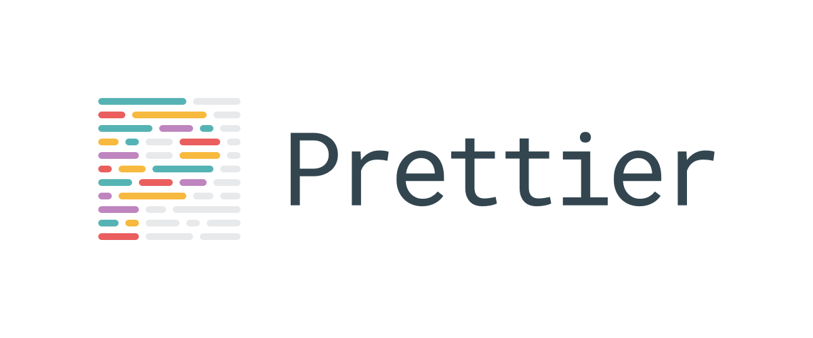

In any programming language, different code quality and formatting discussions emerge. In JavaScript, it is no different. Discussions around the topic exist since the beginning of it.

Many projects start without any configuration, because no one wants to dig into "what is the best code style guide I should follow". This might help devs to not get into [analysis paralysis](https://en.wikipedia.org/wiki/Analysis_paralysis) but, after sometime, the code can get quite messy. Everybody coding in its own way, using made up conventions... The situation gets bad fast.

Some code quality and formatting issues can be usually solved through linters and code formaters.

## Linting: the first step

Linters are useful for a couple of stuff. Since syntax validation and style formatting analysis, to code smell and bad code detection.

The most popular linter in JavaScript is [`eslint`](https://eslint.org/). Using a set of rules, editors with linting support can indicate which parts of the code are breaking determined quality rules, sometimes even auto-fixing it. They are pretty much complete and flexible on it's rules.

The issue is which rules to choose. Some developers use the famous [ Airbnb eslint configs](https://www.npmjs.com/package/eslint-config-airbnb), but people usually over customize it. As the following example, projects using `eslint` can require plenty of `eslint-*` packages and configs to achieve the team settled coding style configuration.

```js
// package.json
...
"eslint-config-airbnb-base": "^5.0.1",
"eslint-config-standard": "^5.3.5",
"eslint-plugin-filenames": "^1.1.0",
"eslint-plugin-import": "^1.12.0",
"eslint-plugin-promise": "^2.0.0",
...
```

```json
// .eslintrc.json
{
  "env": { "mocha": true },
  "parserOptions": { "sourceType": "script" },
  "extends": "airbnb-base",
  "plugins": ["filenames"],
  "rules": {
    "arrow-parens": ["error", "as-needed"],
    "comma-dangle": ["error", "never"],
    "filenames/match-regex": ["error", "^[a-z0-9-.]+$"],
    "import/no-extraneous-dependencies": ["error", { "devDependencies": true }],
    "import/newline-after-import": ["off"],
    "indent": ["error", 4],
    "max-len": ["error", 120],
    "no-console": ["error"],
    "prefer-arrow-callback": ["error", { "allowNamedFunctions": true }],
    "prefer-rest-params": ["off"],
    "prefer-spread": ["off"],
    "quote-props": ["error", "consistent-as-needed"],
    "space-before-function-paren": ["error", "never"]
  }
}
```

## Enter StandardJS

StandardJS is a popular JavaScript community attempt to solve the "too many rules" issue. The team need to only add [`standard`](https://standardjs.com/) linter and it should settle discussions. It is an opionated linter, with [plenty of default rules](https://standardjs.com/#standardjs--the-rules) and [no way for customization](https://standardjs.com/#i-disagree-with-rule-x-can-you-change-it).

There are some complications around StandardJS though (personal opinion: I still like it). Calling it "standard", where it is not actually the "de facto" standard for JS projects, can confuse people (there is even a [disclaimer in their page](https://standardjs.com/#but-this-isnt-a-real-web-standard)). But, the biggest polemic, is the decission to not use semi-colons.

The project arguments it is unnecessary nowadays, as all JS engines can deal with it using Automatic Semicolon Insertion (ASI). The catch is that ASI doesn't work as expected in some cases, and some think it can generate performance penalties.

It is still a good option for linting. If semi-colons are preferred, [`semistandard`](https://github.com/Flet/semistandard) can be used instead.

## Prettier: a no-brainer code formatter for your code



While StandardJS tries to be the no-brainer linting option, Prettier tries to do the same for code formatting.

There are some differences between linters and code formatting, enabling both to be even used together.

As previously said, a linter is a code analysis tool and doesn't apply only to formatting. Code formatter, on the other hand, just care about the code style. Usually, it is run after saving or commiting files, where it rewrites the file using a pre-defined set of code style rules. A [brief comparison can be found here](https://prettier.io/docs/en/comparison.html).

Prettier fits exactly in this category. As it doesn't do code analysis, a linter can still be used together to indicate issues through the code.

It comes with some pre-defined rules, allowing minor customization over it. As it is highly opionated, developers should trust these rules and don't think/discuss them anymore.

Even with this narrow flexibility, there is a way to configure Prettier to be compatible with StandardJS.

## Installing and configuring Prettier and StandardJS

Install the required packages using `npm install husky lint-staged prettier standard`. `husky` and `lint-staged` will enable the implementation of pre-commit hooks, where prettier can be ran.

To make Prettier compatible with StandardJS, create a file named `.prettierrc.json` with the following content:

```json
// .prettierrc.json
{
  "singleQuote": true,
  "jsxSingleQuote": true,
  "noSemi": true
}
```

That's it! To re-format the actual code, run `./node_modules/.bin/prettier --write "**/*.js"`. Be prepared for many files being changed. As it is just code formatting, it will not break anything.

It is a good practice to include an `.editorconfig` file, informing code formatting rules for code editors.

```
# .editorconfig

root = true

[*]
end_of_line = lf
insert_final_newline = true

[*.{js,ts,md,json}]
charset = utf-8
indent_style = space
tab_width = 2
indent_size = 2
trim_trailing_whitespace = true
```

To enable `prettier` pre-commit hook, a change is needed on `package.json`, although many modern editors already enable the same thing in the save process. Other stuff can be added to `lint-staged`, such as StandardJS linting.

```json
...
  "scripts": {
    "lint": "standard"
  },
  "husky": {
    "hooks": {
      "pre-commit": "lint-staged"
    }
  },
  "lint-staged": {
    "*.{js,json,md}": [
      "prettier --write",
      "git add"
    ]
  }
...
```

After these tweaks, the project is fully supporting StandardJS and Prettier. Well done!

## Automating the configuration process

If many projects require this to be setup, perhaps automation could help. I developed a script to do the job, requiring only [`jq`](https://stedolan.github.io/jq/) to be installed. To get it, clone the [`standard-prettierfy`](https://github.com/brunoluiz/standard-prettierfy) repo. Run the script from it's root folder and pass the targeted project folder: `./prettify.sh ../project`.

It will checkout to `master`, pull the new updates and apply the required changes on a branch called `chore/prettier-standard`. It will push the branch, but you will still need to open the Pull Request manually.

## Coding using prettier and standard

With the above configs, most modern editors will already catch-up which formatting and linting rules are in place. `vim` requires some extra configs though. [Check this guide for `prettier` configs](https://prettier.io/docs/en/vim.html). If `ALE` is been used with `vim`, add `let g:ale_linters = { 'javascript': ['standard'] }` to support linting as well.

Now, just seat, relax and code ; )

## References and Credits

- Cover photo by [ Hunter Haley ](https://unsplash.com/photos/s8OO2-t-HmQ) on [Unsplash](https://unsplash.com)
- [`eslint` website](https://eslint.org/)
- [Airbnb eslint configs](https://www.npmjs.com/package/eslint-config-airbnb)
- [`standard` website](https://standardjs.com/)
- [`semistandard` repo](https://github.com/Flet/semistandard)
- [`standard-prettierfy` repo](https://github.com/brunoluiz/standard-prettierfy)
- [Guide for `prettier` vim configs](https://prettier.io/docs/en/vim.html)
